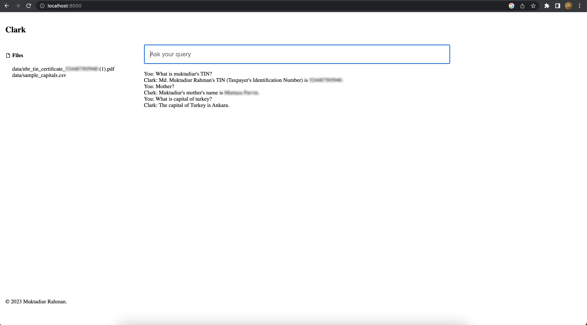

# Clark
Chat with private documents(CSV, pdf, docx, doc, txt) using LangChain, OpenAI/HuggingFace, and FastAPI.



## Installation

Install required packages.
```
python -m venv .venv
source .venv/bin/activate

pip install -r requirements.txt
```

Rename `.env.example` to `.env` and update the OPENAI_API_KEY [OpenAI API key](https://platform.openai.com/account/api-keys), HUGGINGFACEHUB_API_TOKEN [HuggingFace Access Tokens] (https://huggingface.co/settings/tokens).


Place your own data (CSV, pdf, docx, doc, txt) into `data/` folder.

## Run 

### Console
```
python console.py  # to use openai embeddings

python console.py hf  # to use huggingface embeddings

python console.py huggingface   # to use huggingface embeddings

```

```
Welcome to the Clark!
(type 'exit' to quit)
You: what is the capital of Uzbekistan?
Clark: The capital of Uzbekistan is Tashkent.
You: exit
```

### Web 
```
python app.py  # to use openai embeddings

python app.py hf  # to use huggingface embeddings

python app.py huggingface   # to use huggingface embeddings

URL: 
http://127.0.0.1:8000/  
http://127.0.0.1:8000/docs
http://127.0.0.1:8000/redoc
```

### Run in docker
```
docker build -t clark .
docker run -p 8000:8000 -it clark
```

## Project structure
```
.
├── Dockerfile
├── LICENSE
├── README.md
├── app.py
├── console.py
├── data
│   └── sample_capitals.csv
├── document
│   ├── __init__.py
│   ├── conversation.py
│   └── utils.py
├── requirements.txt
├── static
│   ├── auth
│   │   ├── login.html
│   │   └── signup.html
│   ├── base.html
│   ├── home.html
│   ├── images
│   │   ├── clark.jpg
│   │   └── favicon.ico
│   ├── index.html
│   ├── index.js
│   ├── main.css
│   └── spinner.gif
└── test_api.py

6 directories, 21 files
```

