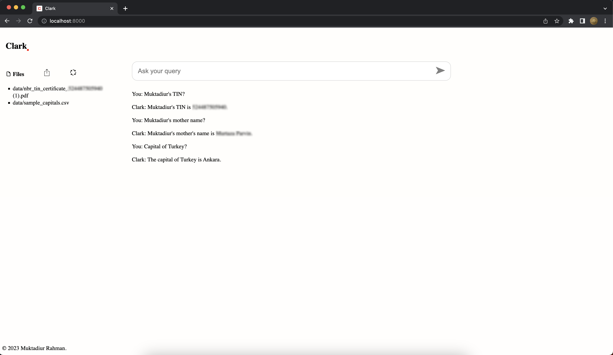

# Clark
Chat with private documents(CSV, pdf, docx, doc, txt) using LangChain, OpenAI, HuggingFace, GPT4ALL, and FastAPI.



## Installation

Install required packages.
```
python -m venv .venv
source .venv/bin/activate

pip install -r requirements.txt
```

Rename `.env.example` to `.env` and update the OPENAI_API_KEY [OpenAI API key](https://platform.openai.com/account/api-keys), HUGGINGFACEHUB_API_TOKEN [HuggingFace Access Tokens] (https://huggingface.co/settings/tokens).


Place your own data (CSV, pdf, docx, doc, txt) into `data/` folder.

## Run

### Console
```
python console.py # default: openai

```

```
Welcome to the Clark!
(type 'exit' to quit)
You: what is the capital of Uzbekistan?
Clark: The capital of Uzbekistan is Tashkent.
You: exit
```

### Web
```
python app.py  # default: openai

URL:
http://127.0.0.1:8000/
http://127.0.0.1:8000/docs
http://127.0.0.1:8000/redoc
```

### Run in docker
```
docker build -t clark .
docker run -p 8000:8000 -it clark
```

### To use HuggingFace
```
Change the CONVERSATION_ENGINE: from `openai`: to `hf` in the `.env` file.
```

### To use GPT4ALL (Slow)
```
mkdir models
cd models
wget https://huggingface.co/nomic-ai/gpt4all-falcon-ggml/resolve/main/ggml-model-gpt4all-falcon-q4_0.bin

Change the CONVERSATION_ENGINE: from `openai`: to `gpt4all` in the `.env` file.
Now read your documents locally using an LLM.

Note: gpt4all performance is slow for now. The average response time is 50 seconds.

```


## Project structure
```
.
├── Dockerfile
├── LICENSE
├── README.md
├── app.py
├── clark
│   ├── __init__.py
│   ├── base.py
│   ├── document.py
│   ├── gpt4all.py
│   ├── helpers.py
│   ├── hf.py
│   └── openai.py
├── console.py
├── data
│   └── sample_capitals.csv
├── requirements.txt
├── static
│   ├── auth
│   │   ├── login.html
│   │   └── signup.html
│   ├── base.html
│   ├── css
│   │   ├── font-awesome.min.css
│   │   └── main.css
│   ├── home.html
│   ├── images
│   │   ├── clark.png
│   │   └── favicon.ico
│   ├── index.html
│   ├── index.js
│   ├── js
│   └── spinner.gif
└── test_api.py

8 directories, 26 files
```

